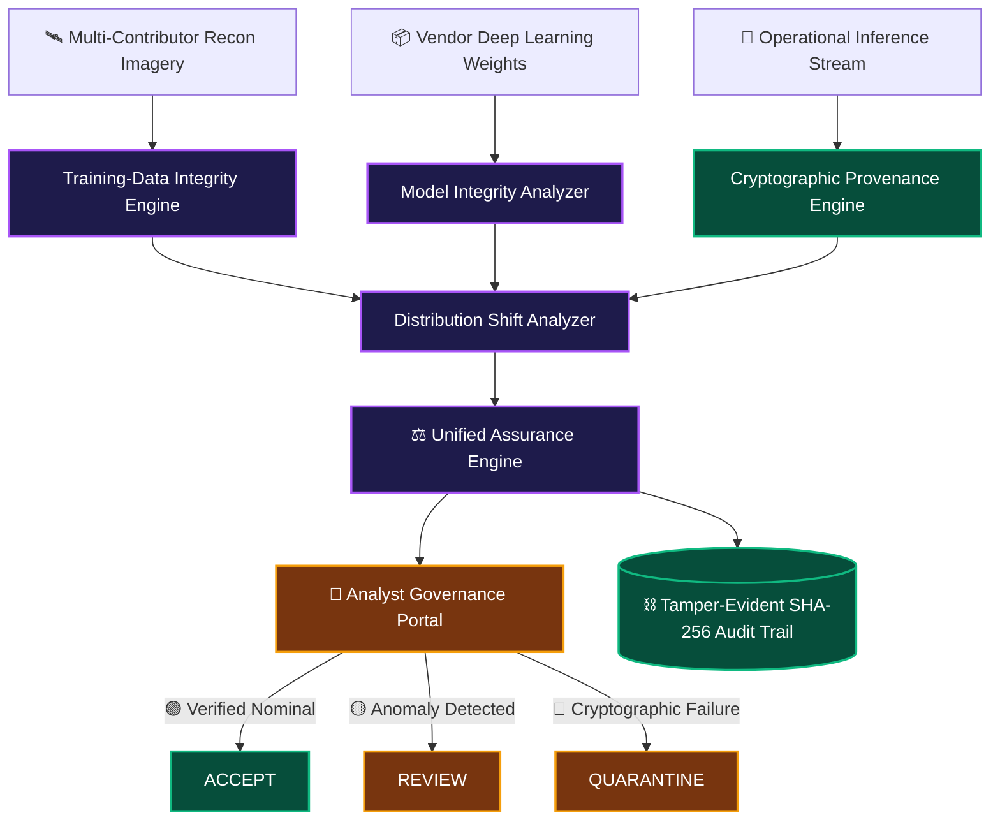

<div align="center">

  

  # 🛡️ DRISHTI-X
  ### **Trustworthy Defence Computer Vision Integrity & Cryptographic Assurance Platform**

  [](https://github.com/HariKrishnahk1/DRISHTI-X)
  [](https://github.com/HariKrishnahk1/DRISHTI-X)
  [](https://github.com/HariKrishnahk1/DRISHTI-X)
  [](https://nextjs.org)
  [](https://fastapi.tiangolo.com)
  [](https://github.com/HariKrishnahk1/DRISHTI-X)

  <p align="center">
    <strong>Zero External Cloud APIs • Bit-Exact Cryptographic Verification • Explainable AI Risk Scores • Tamper-Evident Audit Ledgers</strong>
  </p>

  [Explore Architecture](#-system-architecture) •
  [Key Capabilities](#-the-four-pillars-of-assurance) •
  [Quick Start Guide](#-quick-start-run-locally-in-2-minutes) •
  [Live Demo Walkthrough](#-evaluator--judge-walkthrough-guide) •
  [The Team](#-mission-contributors)

</div>

---

## 🌟 Why DRISHTI-X?

In tactical military environments, an AI vision model making target identification or border reconnaissance decisions **cannot simply be trusted on blind faith**. 

When drone camera feeds, reconnaissance satellite imagery, and deep learning weights come from multiple field units, contractor vendors, and allied reconnaissance divisions, modern pipelines face acute cyber-physical threats:
* 🪤 **Trojan Backdoors:** Hidden triggers in training data that cause a model to mistake a tank for an ambulance when a small patch appears.
* 🔄 **Model Swaps & Supply Chain Tampering:** Unauthorized weight modifications or substitute backbones slipped into deployment.
* ✍️ **Tampered Predictions:** Maliciously altered classification outputs in intelligence databases.
* 🌀 **Distributional Drift:** Environmental fog or snow blinding models without warning.

> [!IMPORTANT]
> **DRISHTI-X does not give a naive, black-box pass/fail.**  
> It constructs **immutable, bit-exact cryptographic evidence bundles, explainable contributor risk indices, and actionable operational dispositions**:
>
> 🟢 **`ACCEPT`** — Mathematically certified & baseline verified  
> 🟡 **`REVIEW`** — Distributional anomaly requiring human analyst review  
> 🔴 **`QUARANTINE`** — Cryptographic mismatch or backdoor trigger detected; isolated immediately

---

## 🏛️ System Architecture



---

## ⚡ The Four Pillars of Assurance

<table>
  <tr>
    <td width="50%">
      <h3>1. 🔍 Training-Data Integrity</h3>
      <ul>
        <li><b>Trigger Anomaly Detector:</b> Multi-scale localized patch cross-correlation & high-frequency spatial residual analysis.</li>
        <li><b>Perceptual Duplicate Flooding:</b> Difference perceptual hashing (<b>dHash</b>) & color histogram correlation to flag synthetic clone flooding.</li>
        <li><b>Label Dissonance:</b> Class centroid variance to catch poisoned annotation labels.</li>
        <li><b>Contributor Risk Index:</b> Explainable attribution of risk back to specific reconnaissance sources.</li>
      </ul>
    </td>
    <td width="50%">
      <h3>2. 🧬 Model Supply Chain Defense</h3>
      <ul>
        <li><b>Cryptographic Substitution Detection:</b> Instant SHA-256 comparison against certified baseline military registries.</li>
        <li><b>8-Pattern Behavioral Battery:</b> Synthetic defence reference battery that fingerprints activation distributions.</li>
        <li><b>Trojan Sensitivity Scans:</b> Controlled localized perimeter perturbation searching for prediction-flip anomalies.</li>
        <li><b>Multi-Engine Adapters:</b> Native support for both <b>ONNX Runtime</b> and <b>PyTorch / TorchScript</b>.</li>
      </ul>
    </td>
  </tr>
  <tr>
    <td width="50%">
      <h3>3. 🔐 Cryptographic Inference Provenance</h3>
      <ul>
        <li><b>7-Point Immutable Binding:</b> Binds Input Digest + Model Hash + Preprocessing Config + Output Hash + Nonce + Sequence # + Timestamp.</li>
        <li><b>Ed25519 Digital Signatures:</b> Asymmetric RFC 8032 digital signatures generated on local secure hardware.</li>
        <li><b>Instant Tamper Detection:</b> Altering a single bit of prediction data immediately yields <code>INTEGRITY_FAILURE</code>.</li>
        <li><b>Replay Guard:</b> Sequence counter tracking to thwart replay attacks.</li>
      </ul>
    </td>
    <td width="50%">
      <h3>4. ⛓️ Tamper-Evident Audit Ledger</h3>
      <ul>
        <li><b>Chained SHA-256 Events:</b> Block-chained structure where each event's digest mathematically binds the prior block:
          $$\text{Hash}_n = \text{SHA-256}(\text{Event}_n \,\|\, \text{Hash}_{n-1})$$
        </li>
        <li><b>Retroactive Tamper Detection:</b> Any unauthorized log modification breaks the entire chain continuity.</li>
        <li><b>Interactive Simulation:</b> Built-in red-team testing tools to simulate tampering and verify detection.</li>
      </ul>
    </td>
  </tr>
</table>

---

## 🛠️ Technology Stack

<div align="center">

| Layer | Technologies Used | Purpose |
| :--- | :--- | :--- |
| **Frontend UI** | `Next.js 14` • `React 18` • `Tailwind CSS` • `Lucide Icons` | Dark tactical mission-control dashboard with real-time Threat Radar |
| **Backend API** | `FastAPI` • `Python 3` • `SQLAlchemy` • `Pydantic v2` | Fully asynchronous, air-gapped REST assurance microservices |
| **Computer Vision** | `OpenCV` • `Scikit-learn` • `SciPy` | Perceptual hashing (dHash), spectral residual cross-correlation |
| **AI / Deep Learning** | `ONNX Runtime` • `PyTorch / TorchScript` | Local inference, behavioral battery activation, perturbation scans |
| **Cryptography** | `Ed25519 (RFC 8032)` • `SHA-256` • `PBKDF2` • `PyJWT` | Hardware-grade digital signing, multi-hash bundles, audit chaining |
| **Database** | `SQLite` *(local air-gapped)* • `PostgreSQL` *(scalable)* | Structured persistence with cryptographic integrity constraints |

</div>

---

## 🚀 Quick Start (Run Locally in 2 Minutes)

### **Prerequisites**
* Python 3.10+
* Node.js 18+ and npm
* Git

```bash
# 1. Clone the repository
git clone https://github.com/HariKrishnahk1/DRISHTI-X.git
cd DRISHTI-X

# 2. Setup Backend Dependencies
pip install -r backend/requirements.txt

# 3. Setup Frontend Dependencies
cd frontend
npm install
cd ..

# 4. Seed Demonstration Data & Certified Models
python scripts/seed_demo.py
```

### **Start the Platform**

```bash
# Terminal 1: Launch FastAPI Backend Engine (Port 8000)
python run_backend.py
```

```bash
# Terminal 2: Launch Next.js Mission Control (Port 3000)
cd frontend
npm run dev
```

🌐 Open your browser and navigate to: **`http://localhost:3000`**  
📖 Interactive Swagger API Docs: **`http://127.0.0.1:8000/docs`**

---

## 🪖 Role-Based Access Control (RBAC) Accounts

DRISHTI-X includes pre-configured defence accounts with tiered operational scopes. On the login page, you can simply click any role card for **one-click authentication**:

| Call-Sign / Username | Password | Role | Military Scope |
| :--- | :--- | :--- | :--- |
| `defence_commander` | `Password123!` | `DEFENCE` | 🎖️ Complete pipeline visibility, risk oversight, approvals & clearance |
| `lead_analyst` | `Password123!` | `ANALYST` | 🔬 Deep integrity scans, forensic inspection & disposition governance |
| `bharat_vendor` | `Password123!` | `VENDOR` | 🏢 Model registry upload, baseline verification & compliance reports |
| `field_contributor` | `Password123!` | `CONTRIBUTOR` | 🛰️ Reconnaissance dataset uploads and source tracking |
| `cag_auditor` | `Password123!` | `AUDITOR` | ⚖️ Tamper-evident audit chain inspection & compliance validation |

---

## 🎯 Evaluator & Judge Walkthrough Guide

Here is a 5-step test script to evaluate all major defence capabilities locally:

1. **Mission Control Dashboard (`/dashboard`):**  
   Log in as **Defence Commander**. Observe the real-time Threat Radar, overall pipeline assurance grade, active quarantine flags, and audit validity.
2. **Dataset Backdoor & Duplicate Flooding (`/datasets`):**  
   Click into `TACTICAL_ARMOR_TRIGGER_ANOMALY`. Click **"Run Integrity Scan"** to watch the spatial residual cross-correlation uncover hidden Trojan triggers. Inspect the explainable **Contributor Source Risk** breakdown.
3. **Model Substitution Detection (`/models`):**  
   Inspect `SUSPECT_SURVEILLANCE_BACKBONE`. Observe the red **"SUBSTITUTION DETECTED"** banner showing exact deviation between the certified expected hash and the observed file hash. Review the 8-pattern behavioral battery graph.
4. **Cryptographic Provenance & Tamper Demonstration (`/inference`):**  
   * Select a model, pick an image, and click **"RUN & SIGN INFERENCE"**. Observe the Ed25519 digital signature and 7-point cryptographic binding.  
   * Click **"TAMPER TEST"** to simulate an adversary modifying the stored classification on disk.  
   * Click **"RE-VERIFY PROVENANCE"** and watch the system instantly flag **`INTEGRITY_FAILURE`**!
5. **Tamper-Evident Audit Trail (`/audit`):**  
   Click **"VERIFY AUDIT INTEGRITY"** to confirm mathematical continuity. Then click **"SIMULATE AUDIT TAMPERING"** to simulate an insider changing an old log entry, and see the audit chain catch the exact compromised block.

---

## 👥 Mission Contributors

This project was built with dedicated ownership across six key engineering domains:

<div align="center">
<table>
  <tr>
    <td align="center" width="16.6%">
      <a href="https://github.com/HariKrishnahk1">
        <br />
        <sub><b>Hari Krishna</b></sub>
      </a><br />
      <small><code>HariKrishnahk1</code></small><br />
      <sub>👑 System Lead<br />Cryptographic Engine & Provenance</sub>
    </td>
    <td align="center" width="16.6%">
      <a href="https://github.com/naturehari">
        <br />
        <sub><b>Nature Hari</b></sub>
      </a><br />
      <small><code>naturehari</code></small><br />
      <sub>🔍 Computer Vision<br />Data Integrity & Trigger Search</sub>
    </td>
    <td align="center" width="16.6%">
      <a href="https://github.com/Divya0202941">
        <br />
        <sub><b>Divya</b></sub>
      </a><br />
      <small><code>Divya0202941</code></small><br />
      <sub>🧬 Model Defense<br />Behavioral Battery & Adapters</sub>
    </td>
    <td align="center" width="16.6%">
      <a href="https://github.com/deepikadp30">
        <br />
        <sub><b>Deepika</b></sub>
      </a><br />
      <small><code>deepikadp30</code></small><br />
      <sub>💻 Mission Control UI<br />Frontend Architecture & Radar</sub>
    </td>
    <td align="center" width="16.6%">
      <a href="https://github.com/kumaranbk48-code">
        <br />
        <sub><b>Bharathkumaran</b></sub>
      </a><br />
      <small><code>kumaranbk48-code</code></small><br />
      <sub>🗄️ Database & RBAC<br />Security & Ingestion Services</sub>
    </td>
    <td align="center" width="16.6%">
      <a href="https://github.com/gowsalyaveerappan01-aids">
        <br />
        <sub><b>Gowsalya</b></sub>
      </a><br />
      <small><code>gowsalyaveerappan01-aids</code></small><br />
      <sub>📈 Distribution Shift<br />Assurance QA & Deployment</sub>
    </td>
  </tr>
</table>
</div>

---

## 📜 Problem Statement Attribution

> **Problem Statement ID:** SIH26228  
> **Organization:** Ministry of Defence, Government of India  
> **Department:** Indian Army / Directorate General of Information Systems (DGIS)  
> **Theme:** Blockchain, Cybersecurity & Trustworthy AI  
> **Operational Mandate:** Secure Air-Gapped Verification for Edge and Command Workstations

---

<div align="center">
  <sub>Engineered with precision for National Defence & Sovereign AI Integrity 🇮🇳</sub>
</div>
